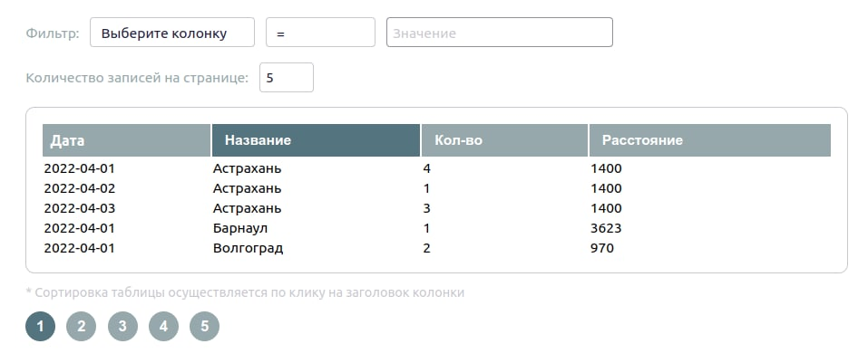

# Технологии
React, Redux, styled-components.

API (backend часть проекта) находится здесь: https://github.com/Malluma/filter_table_backend.git.

# Описание

Tаблица в формате Single Page Application.

Таблица содержит 4 колонки: Дата, Название, Количество, Расстояние.

Таблица имеет функцию **сортировки** по возрастанию по всем колонкам, кроме "Дата". Сортировка осуществляется при клике на заголовок соответствующего столбца.

**Фильтрация** реализована в виде двух выпадающих списков и текстового поля:
  + Выбор колонки, по которой будет фильтрация
  + Выбор условия (равно, содержить, больше, меньше)
  + Поле для ввода значения для фильтрации

Таблица имеет пагинацию: с сервера получаются только данные конкретной выбранной страницы. Количество записей на странице установлено по умолчанию равным 5, его можно менять.

## Развертывание проекта
+ Клонирование репозитория:

  `git clone git@github.com:Malluma/filter_table.git`
+ Установка зависимостей:

  `npm install`
+ Запуск проекта:

  `npm start`
  
node version: v16.13.1 
